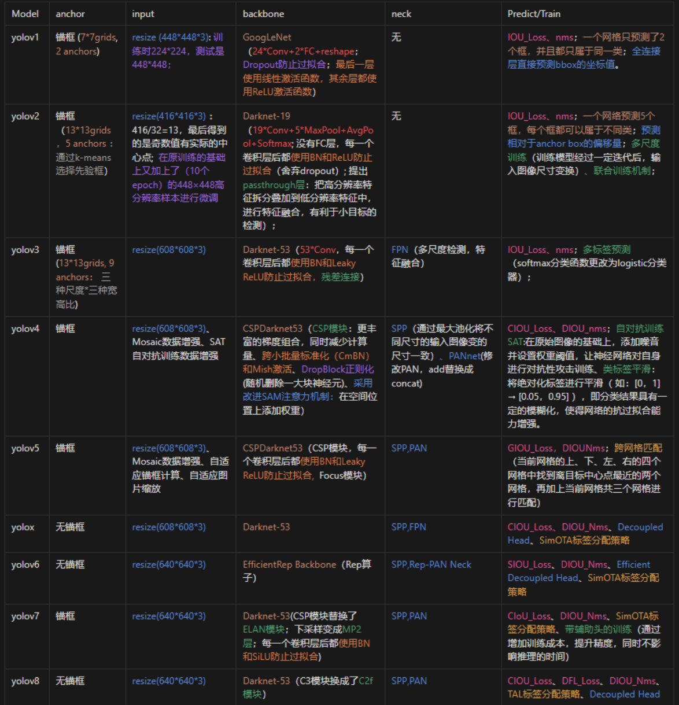

# OD object detection
##  RCNN
### RCNN 算法流程
* 直接固定了输入图像分辨率，
* 1 一张图片生成1k~2k个候选区域（使用Selective Search方法），
* 2 对每个候选区域，使用深度网络提取特征 -> 2000x4096 ，
* 3 特征送入每一类的SVM分类器，判别是否属于该类，
* 4 使用回归器精细修正候选框位置，

### RCNN框架
* Region proposal（Selective Search）
* Feature extraction（CNN）
* Classification（SVM）、Bounding-box regression（regression）

## Fast RCNN
### Fast R-CNN 算法流程
* 1 一张图像生成1k~2k个候选区域（使用Selective Search方法）-> sample
* 2 将图像输入网络得到对应的特征图，将SS算法生成的候选框投影到特征图获得相应的特征矩阵，
* 3 将每个特征矩阵通过ROI pooling层缩放到7x7大小的特征图（此处并没有限制输入特征图的size，也就是不限制输入图像分辨率的），接着将特征图战平通过一系列全连接层得到预测结果， Region of interset
* 输出 N（检测类别）+1（背景）个类别的概率
* 边界框回归器 ->  xywh x （N+1）
* loss = clasiifier_loss + box_loss
### Fast R-CNN框架
* Region proposal(Selective Search)  <cpu计算速度慢>
* Feature extraction、Classification、Bounding-box regression(CNN)

## Faster R-CNN
### Faster R-CNN算法流程
* 1 将图像输入网络得到相应的特征图
* 2 使用RPN结构生成候选框，将RPN生成的候选框投影到特征图上获得相应的特征矩阵
* 3 将每个特征矩阵通过ROI pooling层缩放到7x7大小的特征图，接着将特征图通过一系列全连接层得到预测结果
### Faster R-CNN框架
* （CNN）Region proposal、Feature extraction、Classification、Bounding-box regression
#### RPN Region Proposal Network
* 对于特征图上每个3x3的晃动窗口，计算出滑动窗口中心点对应于原始图像上的中心点，并计算k个anchor boxes（注意和proposal的差异）
```
  sliding-window -> 256-d(feature-depth)
  ->
  --cls_layer-->2k scores、
  --reg_layer-->4k coordinates (xywh)
```
* 正样本/负样本   --sample256 (1:1 or a:(256-a))
* 正样本： iou > thre;  iou is max
* 负样本： iou_all < 0.3 
```
--------RPN Multi-task loss---------------
* 分类损失函数：1/Ncls
Ncls就是sample数量256

* 边界框回归损失函数： lambda/Nreg Σ（）
lambda=10
Nreg 就是 anchor位置的个数（2400）  

anchor：  （根据设置）锚框
    |RPN
    v
候选框proposal：   （RPN、算法）生成的bounding-box

（输入特征图）每一个像素点生成k个anchor（k=9）
并不是所有的anchor都会被拿来训练，只会保留2k左右（2400）

.3021651
# 正负样本、anchor  ？？？？
正负样本    -> 训练RPN， cls   ??
anchor     -> cls + bbox_reg  ??
```




